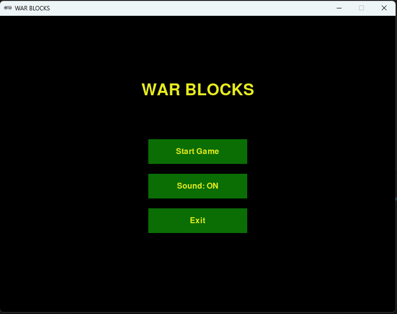
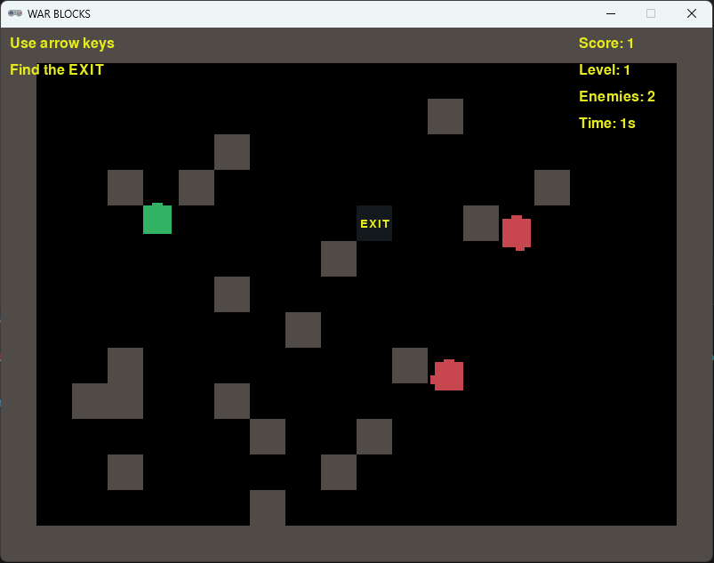
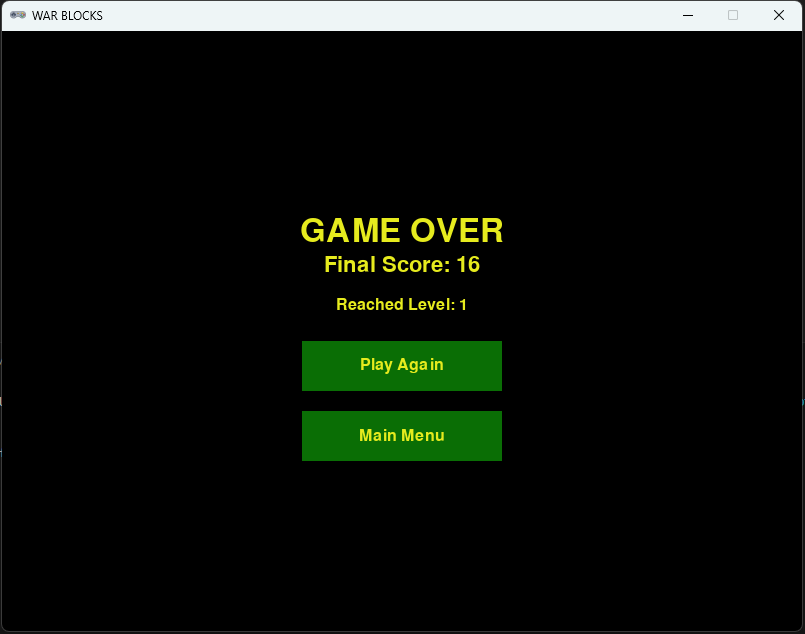

# 🎮 WAR BLOCKS


## 📖 Sobre o Projeto

**WAR BLOCKS** é um jogo 2D desenvolvido em **Python** usando a
biblioteca **Pygame Zero**.\
O objetivo é guiar o jogador pelo labirinto, evitar inimigos e encontrar
a **saída (EXIT)** para avançar de nível.\
O jogo foi projetado para teste prático respeitando os requisitos solicitados

------------------------------------------------------------------------

## 🚀 Funcionalidades

-   ✅ Menu inicial com botões interativos\
-   ✅ Controle do jogador com teclas de direção (setas)\
-   ✅ Inimigos com inteligência simples (seguem o jogador)\
-   ✅ Sistema de níveis progressivos\
-   ✅ Pontuação baseada no tempo e progresso\
-   ✅ Sons de fundo e efeitos (quando disponíveis)\
-   ✅ Tela de **Game Over** com opções de reinício

------------------------------------------------------------------------

## 🕹️ Controles

-   ⬆️ **Cima** → Move o personagem para cima\
-   ⬇️ **Baixo** → Move o personagem para baixo\
-   ⬅️ **Esquerda** → Move o personagem para a esquerda\
-   ➡️ **Direita** → Move o personagem para a direita

------------------------------------------------------------------------

## 📦 Instalação

### 1️⃣ Clone o repositório

``` bash
git clone https://github.com/seu-usuario/war-blocks.git
cd war-blocks
```

### 2️⃣ Crie um ambiente virtual (recomendado)

``` bash
python -m venv venv
source venv/bin/activate   # Linux/Mac
venv\Scripts\activate    # Windows
```

### 3️⃣ Instale as dependências

``` bash
pip install pgzero pygame
```

### 4️⃣ Execute o jogo

``` bash
pgzrun main.py
```

------------------------------------------------------------------------

## 📂 Estrutura do Projeto
``` bash
war-blocks/
├── assets/                # Pasta com prints de tela
│   ├── tela_game_over.png # Tela de fim de jogo
│   ├── tela_jogo.png      # Tela principal
│   ├── tela_menu.png      # Tela de entrada
├── sounds/                # Pasta de arquivos de áudio
│   ├── menu_bg.ogg        # Música do menu
│   ├── game_bg.ogg        # Música do jogo
│   ├── collision.ogg      # Som de colisão
│   ├── level_complete.ogg # Som de nível completo
│   ├── exit_found.ogg     # Som de saída encontrada
│   └── button_click.ogg   # Som de clique de botão
├── .gitignore             # Arquivo de configuração do git
├── LICENSE
├── main.py                # Arquivo principal do jogo
└── README.md              # Este arquivo
```
------------------------------------------------------------------------

## 📸 Capturas de Tela

### Tela Inicial


### Gameplay


### Game Over


------------------------------------------------------------------------

## 📚 Tecnologias Utilizadas

-   [Python 3.10+](https://www.python.org/)\
-   [Pygame Zero](https://pygame-zero.readthedocs.io/en/stable/)\
-   [Pygame](https://www.pygame.org/news)

------------------------------------------------------------------------

## 👨‍🏫 Objetivo Educacional

Este projeto foi desenvolvido como um **teste prático** para a Kodland:\
- Estruturas de classe em Python\
- Conceitos de **herança** (`Enemy` herdando de `Character`)\
- Manipulação de **colisões** usando `Rect`\
- Uso de **loops de jogo** (`update` e `draw`)\
- Integração de **sons e eventos**

------------------------------------------------------------------------

## 📜 Licença

Este projeto está sob a licença **MIT** - veja o arquivo
[LICENSE](LICENSE) para mais detalhes.

------------------------------------------------------------------------

👨‍💻 Desenvolvido por **Mauricio De Oliveira**
